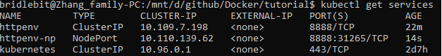
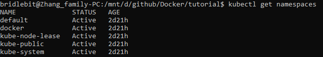
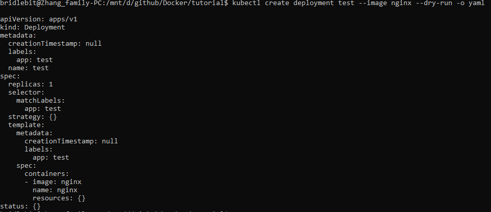
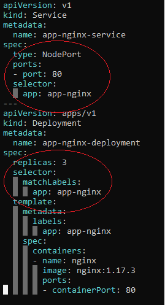

```{css, echo=FALSE}
.inputcode{
    background-color: #90EE90
    }
.outputcode{
    background-color: #B0C4DE
}
```

```{r, echo=FALSE}
knitr::opts_chunk$set(comment="",
                      message=FALSE,
                      class.source="inputcode",
                      class.output="outputcode", 
                      tidy=TRUE)

```

## Intruduction 
* What and Why Kubernetes
* kubernetes: popular container orchestrator
* container orchestration = make many servers/nodes act like one, automate change, monitor the state
* provides API/CLI to manage containers across servers
* many clouds provide it for you
* many verdors make a distribution of it
* Common distributions: Docker enterprise, RACHER, Redhat Openshift, Ubuntu kubernetes, VMWare PKS.

#### Kubernetes vs swarm
* both are solid platforms with vendor backing
* swarm: easier to deploy/manage, runs anywhere Docker does
* swarm: comes with Docker, single vendor containers platform
* swarm: secure by default, easier to troubleshoot

* Kubernetes: the whole orchestration system 
* Kubernetes: clouds deploy/manage for you 
* Kubernetes: more features and flexibility
* Kubernetes: covers widest set of use cases
* trendy will benefit your career

#### Terminology
* Kubectl: CLI to configure kubernetes and manage apps
* node: single server in the kubernetes cluster
* kubelet: kubernetes agent running on nodes
* control plane: set of containers that manage the cluster
    + (master) includes: etcd, API, scheduler, controler manager, core DNS
    + (node/agent) includes: kubelet, kube-proxy

#### Install locally
* Kubernetes is a series of containers, CLI's and configureations
* factors: RAM utilization, easily shutdown, easily reset, easily used on local sys
* Docker desktop > Docker toolbox minikube > linux host VM Micro8s
* <http://play-with-k8s.com> or <http://katacoda.com>

#### Abstractions
* pod: one or more containers running together on one node
* basic unit of deployment. containers are always in pods
* controller: for creating/updating pods and other objects includes: Deployment, ReplicaSet, StatefulSet, DaemonSet, Job, CronJob etc.
* service: network endpoint to connect to a pod
* Namespace: filtered group of objects in cluster (not a security feature)
* secrets, ConfigMaps and more

## Run create and apply
* three ways to create pods from the kubectl CLI
    + kubectl run (changing to be only for pod creation; $\approx$ docker run, which create a single pod where docker run creates a single container)
    + kubectrl create (create some resources via cli or yaml; $\approx$ docker create for swarm)
    + kubectl apply (create/update anything via yaml; $\approx$ stack deploy with swarm) 

## Creating pods with kubectl
    ```{bash, eval=F}
    kubectl version
    kubectl run my-nginx --image nginx
    kubectl get pods
    kubectl get all
    kubectl delete deployment my-nginx
    ```
kubectl run nginx --image nginx created a Deployment named nginx before k8s version 1.18;
kubectl run nginx --image nginx created a Pod named nginx for version 1.18+;
Kubectl create deployment nginx --image nginx: created a Deployment in 1.18;

## Scaling ReplicaSet
* Start a new deployment for one replica/pod
    ```{bash, eval=F}
    kubectl run my-apache --image httpd
    kubectl get all
    ```
* scale up to 2
    ```{bash, eval=F}
    kubectl scale deploy/my-apache --replicas 2
    kubectl get all
    ```
same as `kubectl scale deployment my-apache --replicas 2`, those are the same command:
depoly = deployment = deployments

## Inspecting Deployment objects
    ```{bash, eval=F}
    #cont
    kubectl get pods
    ```
NAME                       |  READY  |  STATUS  |  RESTARTS |  AGE
-------------------------- | ------- | -------- | ----------| -----
my-apache-5d589d69c7-qhlhw |  1/1    | Running  |     0     |  11m
my-apache-5d589d69c7-z4xs2 |  1/1    | Running  |     0     |  8m49s

* get container logs
    ```{bash, eval=F}
    #cont
    kubectl logs deploy/my-apache
    #just show the now log for the last line
    kubectl logs deploy/my-apache --follow --tail 1 
    ```
* get details about an object including events
    ```{bash, eval=F}
    #use -l (label)
    kubectl logs -l run=my-apache
    kubectl describe pod/my-apache-5d589d69c7-qhlhw
    ```
* watch a command 
    ```{bash, eval=F}
    kubectl get pods -w
    kubectl delete pod/my-apache-5d589d69c7-qhlhw
    ```
* watch the pod get re-created

## Exposing Kubernetes ports

* exposing containers
    + `kubectl expose` creates a service for existing pods 
    + `kuberctl ingress` later
    + There're four different types of services: 
        - ClusterIP: single, internal virtual IP allocated; only reachable from within cluster; pods can reach services on apps port number
        - NodePort: high port allocated on each node; port is open on every node's IP
        - LoadBalancer: most used in clouds, only available when infra provider gives you a LB (AWS ELB etc)
        - ExternalName: add CNAME DNS record to CoreDNS only; not used for pods but for giving pods a DNS name to use for outside kubernetes.

* Creating a ClusterIP service
    + open two shell windows and in 1st window
    ```{bash, eval=F}
    kubectl get pods -w

    ```
     + 2nd window
    ```{bash, eval=F}
    #the default type is clusterIP
    kubectl create deployment httpenv --image=bretfisher/httpenv 
    kubectl scale deploy/httpenv --replicas=5
    kubectl expose deploy/httpenv --port 8888
    # look up what IP was allocated
    kubectl get service #should be two, httpen and kubernetes
    
    ```
This IP is cluster internal only
    ```{bash, eval=F}
    kubectl run --generator run-pod/v1 tmp-shell --rm -it --image bretfisher/netshoot -- bash
    curl httpenv:8888
    curl httpenv:8888
    ```

* Create a NodePort service

    + expose a NodePort so we can access it via the host IP (including localhost)
    ```{bash, eval=F}
    kubectl get all
    kubectl expose deployment/httpenv --port 8888 --name httpenv-np --type NodePort
    curl localhost:31265
    ```
 

 check <http://localhost:31265> \

 The port on the left side of : (8888) is the one inside the cluster and inside the container itself. The port on the right side is the one on the node
to outside of the world. The port number is from a port range 30000-32757 preset inside container cluster. to avoid IP conflict.
These three service ClusterIP->NodePort->LoadBalancer are additive, e.g. each one creates the ones above it. If create LoadBalancer, ClusterIP and 
NodePort will be created automatically.

* Add a LoadBalancer service; 
 Docker desktop provides a built-in LoadBalancer
    ```{bash, eval=F}
        kubectl expose deployment/httpenv --port 8888 --name httpenv-lb --type LoadBalancer
        curl localhost:8888
    ```
 check <http://localhost:8888> \
* Clean up
    ```{bash, eval=F}
    kubectl delete service/httpenv service/httpenv-np 
    kubectl delete service/httpenv-lp deploy/httpenv 
    ```

* Kubernetes services DNS
Starting with 1.11 (local version 1.16.5), internal DNS is provided by CoreDNS. \
Like swarm, this is DNS-Based service discovery \
So far we have been using hostnames to access services \
    ```{bash, eval=F}
        curl <hostname>
    ```
but that only works for services in the same Namespace \

        `kubectl get namespaces`

 

Services also have a FQDN \
        `curl <hostname>.<namespace.svc.cluster.local>`

## Kubernetes management

* run, expose and create generators
  These cmd use helper templates called "generators" \
  Every resource in kubernetes has a specification or "spec" \
  You can output those templates with `--dry-run -o yaml` \ 
  You can use those yaml defaults as a starting point \

        `kubectl create deployment test --image nginx --dry-run -o yaml`

 

        `kubectl create job test --image nginx --dry-run -o yaml` \
        `kubectl create deployment test --image nginx` \
        `kubectl expose deploy/test --port 80 --dry-run -o yaml` \
  clean up \
        `kubectl delete deploy/test`

* The future of kubectl run
    + verion (1.12-1.15) run is in a state of flux. Its features is reduced to only create pods.
    + Right now it defaults to creating deployments (with the warning)
    + It has lots of generators but they are all deprecated.  
    + The idea is to make it easy like `Docker run` for one-off tasks
    + It's no recommended for production
    + Use for simple dev/test for troubleshooting pods.
    + Old run confusion

    ```{bash, eval=F}
      kubectl run test --image nginx --dry-run 
      kubectl run test --image nginx --port 80 --expose --dry-run 
      kubectl run test --image nginx --restart OnFailure --dry-run 
      kubectl run test --image nginx --restart Never --dry-run 
      kubectl run test --image nginx --schedule "*/1 ****" --dry-run
    ```

* Imperative vs declarative
    + Imperative focuses on _how_ a program operates. (engine or protocol)
          - kubernetics imperative: `kubectl run, kubectl create deployment, kubectl update`
          - we start with a state we know (no deployment exists)
          - we ask `kubectl run` to create a deployment
          - different cmd are required to change that deployment
          - different cmd are required per object
          - Imperative is easier when you know the state
          - Imperative is easier to get started
          - Imperative is easier for humans at the CLI
          - Imperative is __NOT__ easy to automate

    + Declarative focuse on _what_ a program should accomplish (place an order)
          - declarative: kubectl apply -f my-resources.yaml \
            we don't know the current state \
            we only know what we want the end of result to be (yaml contents) \
          - same command each time
          - resources can be all in a file or many files
          - requires understanding the YAML keys and values
          - more work than kubectl run for just starting a pod
          - The easist way to automate
          - The eventual path to GitOps happiness
    + Three management approaches
          - imperative cmd: run, expose, scale, edit, create deployment \
            best for dev/learning/personal projects \
            easy to learn, hardest to manage over time \
          - imperative object: create -f file.yml, replace -file.yml, delete ... \
            good for prod of small environments, single file per command \
            store your changes in git-based yaml files \
            hard to automate \
          - Declarative: apply -f file.yml or dir\, diff \
            best for prod, easier to automate \
            harder to understand and predict changes \
          - most important rule: \
            don't mix the three approaches \
            learn the imperative CLI for easy control of local and test setups \
            move to apply -f file.yml and apply -f directory for prod \
            store yaml in git, git commit each change before you apply

## Moving to declarative kubernetes YAML

* kubectl apply \
    skipped kubectl create/replace/edit because they don't have solid dev operations. \

    + create/update resources in a file \
      `kubectl apply -f myfile.yaml` \
    + create/update a whole directory of yaml \
      `kubectl apply -f myyaml/`
    + create/update from a url \
      `kubectl apply -f http://bret.run/pod.yml` \
      win PoSh? start <https://bret.run/pod.yml>

* kubernetes configuration YAML (using manifests to control resources)
    + kubernetes configuration file (YAML or JSON)
    + each file contains one or more manifests
    + each manifest describes an API object (deployment, job, secret)
    + each manifest needs four parts (root key:values in the file)
    ```{bash, eval=F}
        apiVersion:
        kind:
        metadata:
        spec:
    ```
    + example in: \
    `/mnt/d/github/Docker/tutorial/udemy-docker-mastery/k8s-yaml` 

* Building your YAML file
    + kind: we can get a list of resourcs the cluster supports \
    ```{bash}
        kubectl api-resources
    
    ```
    + notice some resources have multiple API's (new vs old) \

    + apiVersion
    ```{bash}
        kubectl api-versions
    ```
    + metdata: only name is required
    + spec: where all the action is at!

* Building your YAML spec
    + we can get all the keys each kind supports 
    ```{bash}
        #apiVersion: v1
        #kind: Service
        kubectl explain services --recursive 
    ```
    + sepc section 
    ```{bash}
        kubectl explain services.spec 
    ```
    + sepc type 
    ```{bash}
        kubectl explain services.spec.type 
    ```
    + can have a sub spec: of other resources
    ```{bash}
        kubectl explain deployment.spec.template.spec.volumes.nfs.server
    ```
    + we can also use docs
      <https://kubernetes.io/docs/reference/#api-reference>

* Dry runs and Diff's
    + dry-run a create (client side only) 
    ```{bash, eval=F}
    yml=/mnt/d/github/Docker/tutorial/udemy-docker-mastery/k8s-yaml/app.yml  
    kubectl apply -f ${yml} --dry-run
    kubectl apply -f ${yml} --server-dry-run
    ```
    + see a diff virually
      `kubectl diff -f app.yml`

* Labels/annotations and label selector
    + Labels and Annotations
          Labels goes under `metadata:` in your YAML
        - simple list of `key:value` for identifying your resource later by selecting, grouping, or filtering for it.
        - common examples include: tier:frontend, app:api, env:prod, customer:acre.co
        - not meant to hold complex, large, or non-identifying info. which is annotations are for.
        - filter a get cmd
          `kubectl get pods -l app=nginx`
        - apply only matching labels
          `kubectl apply -f myfile.yaml -l app=nginx`
    + Label selectors
        - the glue telling services and deployments which pods are theirs
        - many resources use label selectors to link resource dependences
        - you will see these match up in the service and deployment YAML
        
          


## More features and the future
* Storage in kubernetes
    + StatefulSets: a new resource type, making pods more sticky
    + avoid stateful workloads for first few deployment until you're good at basics
    + use db-as-a-service whenever you can
    + Creating and connecting volumes: 2 types
        - volumes: tided to lifecycle of pod, all containers in a single pod can share them
        - PersistentVolumes: created at the cluster level, outlives a pod; separate storage config from pod. \
          multipe pods can share them.
        - CSI plugins are the new way to connect to storage

* ingress controler
    + how do we route outside connections based on hostname or URL?
    + ingress controllers do this with 3rd party proxies
    + nginx is popular, but Traefix, HAProxy, F5, Envoy, Istio, etcs

* CRD's and the Operator Pattern
    + you can add 3rd party Resources and Controllers
    + This extends Kubernetes API and CLI
    + Operator: automate deployment and management of complex apps
    + databases, monitoring tools, backups, custom ingresses

* Higher deployment abstractions
    + all our `kubectl` cmd just talk to the k8s API
    + k8s has limited built-in templating, versioning, tracking and management of your apps
    + over 60+ 3rd party tools to delpoy apps on k8s
    + Helm is the most popular
    + "Compose on kubernetes" comes with Docker desktop
    + These are optional, and your distro may have a preference.

* Templating YAML
    + many of deployment tools have templating options
    + you'll need a solution as the number of env/app grow
    + __Helm__ was the first winner in this space but can be complex
    + official __Kustomize__ feature works out of the box (1.14+)
    + `docker app` and compose-on-kubernetes are Docker's way
    + version YAML 

* Kubernetes Dashboard
    + Default GUI for "upstream" kubernetes \
      <https://github.com/kubernetes/dashboard>
    + some distributions have their own GUI (Rancher, Docker Ent, OpenShift)
    + Clouds don't have it by default
    + Let's you view resources and upload YAML
    + Safety first 

* Kubectl namespaces and context
    + namespaces limit scope, aka "virtual clusters"
    + not related to Docker/Linux namespaces
    + won't need them in small clusters
    + There're some built-in, to hide system stuff from `kubectl` "user" \
      `kubectl get namespaces` \
      `kubectl get all --all-namespaces` \
    + context changes `kubectl` cluster and namespaces
    + See <~/.kube/config> file \
      `kubectl config get-contexts` \
      `kubectl config set*` \

* The future of k8s
    + more focus on stability and security
    + server side dry-run
    + Helm 3.0
    + More and improved Operators
    + More declarative-style features
    + Better windows server support
    + more edge cases, kubeadm HA clusters
* Related projects
    + knative - serverless workloads on kubernetes
    + k3s - mini, simple kubernetes
    + k3OS minimal Linux OS for k3s
    + Service Mesh


