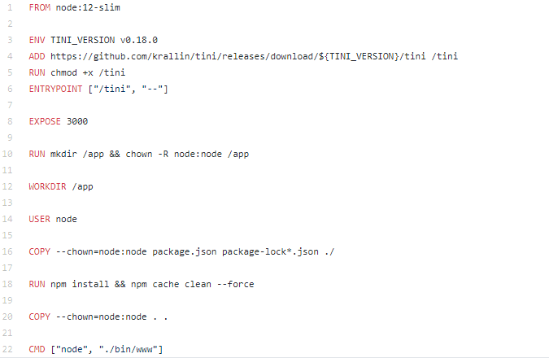
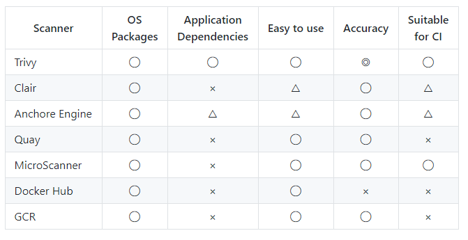

```{css, echo=FALSE}
.inputcode{
    background-color: #90EE90
    }
.outputcode{
    background-color: #B0C4DE
}
```

```{r, echo=FALSE}
knitr::opts_chunk$set(comment="",
                      message=FALSE,
                      class.source="inputcode",
                      class.output="outputcode", 
                      tidy=TRUE, 
                      cache=TRUE)
options(width=100)

```
--- This section is based on [this site](https://github.com/BretFisher/ama/issues/17).

## Cgroup and kernel namespaces
* Namespackes: limiting scope per program/container such as view, access, networking, memory, files on disk.
* Cgroup (control group): limiting resource usage; tell a container only use 1GB of RAM, one CPU

## Security features implemented in each project
* Just use Docker \
  Running an app in a default-settings Docker Linux container greatly reduces you risk profile vs. just running that app on a full
  Linux VM OS. Only official images.
* Scan your hosts for proper Docker config
* Don't run apps in containers as root
* Enable "user namespaces"
* Code repo scanning <https://snyk.io>
* AppArmor: <https://wiki.ubuntu.com/AppArmor>
* Image scanning

## Docker bench <https://github.com/docker/docker-bench-security>
* scanning the Docker configuration: installation, needed permissions
* Run it on the host that has Docker installed. It gives you different colors ranking security scores.
* CIS benchmarks: <https://www.cisecurity.org/cis-benchmarks/>

## Using USER in Dockerfile to avoid running as root

```{bash}
docker run -d --name nginx nginx 
docker top nginx
```
* From Node Dockerfile
```{bash eval=F}
FROM buildpack-deps:stretch

RUN groupadd --gid 1000 node \
  && useradd --uid 1000 --gid node --shell /bin/bash --create-home node
```
* Specify/change USER in Dockerfile \
    <https://github.com/BretFisher/dockercon19/blob/master/2.Dockerfile>
    

* Enable "user namespace "
    + Per host setting that you set in the docker configuration. The Docker JSON. 
    + Tell Docker any time it creates a new container to run that container as a non root user on the host. 
    + It will be running as a high numerbed user, not a root. That user doesn't have any previleges outside that container.

* Code repo and image scanning \
    + Code scanning dependencies <https::/snyk.io>
    + image scanning dependecies, packages
        - trivy: <https://github.com/aquasecurity/trivy>
            
        -  _microscanner_: <https://github.com/aquasecurity/microscanner> \
          adding microscanner to your Dockerfile
    ```{bash, eval=F}
        ADD https://get.aquasec.com/microscanner /
        RUN chmod +x /microscanner
        RUN /microscanner <TOKEN> [--continue-on-failure]
    ```
    + nearly no image is zero vulnerabilities

## Stopping bad behavior
* runtime bad behavior monitoring [Sysdig Falco](https://sysdig.com/opensource/falco/)
* content trust: signing your code
* check out [AppArmor](https://gitlab.com/apparmor/apparmor/-/wikis/home), [SELinux](https://selinuxproject.org/page/Main_Page), [Seccomp](https://docs.docker.com/engine/security/seccomp/)

## Docker root-less mode
* an option for running the dockered daemon as a normal user on the host.
* <https://get.docker.com/rootless>


